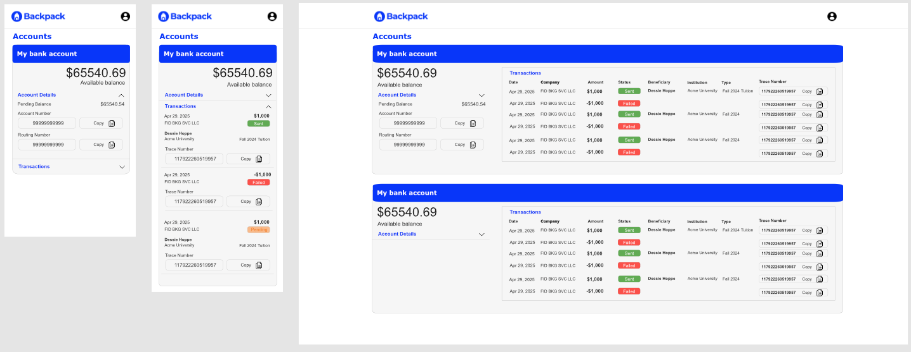
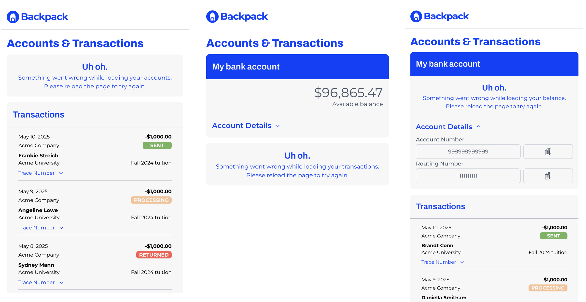

# Responsive Transaction UI

## Project Requirements
Build a UI that displays a customer’s bank account and routing
numbers, available and pending balances, and transactions.

* UI for displaying, concealing, and copying account and routing numbers
* UI for displaying the current and available balance
* UI for displaying transactions
* README that explains your decisions and design choices and also includes instructions
on how to run the application.
* Technology requirements: Build the web app using React. The rest is up to you!

## Running the App
#### Location installation
1. Clone this repo
2. Install dependencies in the root directory with `npm install`
3. To run the app locally, start the development server with `npm run dev` while in the root directory
4. Open http://localhost:5173/
#### Deployed app
You can also viewed the deployed app at https://backpack-take-home.netlify.app/

## Technology
* [React](https://tanstack.com/query/latest) 
* [Tanstack Query](https://tanstack.com/query/latest) 
* [TypeScript](https://www.typescriptlang.org/) 
* [Tailwind CSS](https://tailwindcss.com/) 
* [Headless UI](https://headlessui.com/) 
* [Vite](https://vite.dev/) 

## Design and Mockup
The design is based on elements from the Backpack website including colors, logo, shapes and fonts - derived from inspecting the site. Using those, I created a simple mockup to establish the layout and outline the components.

### Mockups

### Fonts
Header Font - [Archivo](https://fonts.google.com/specimen/Archivo) 
Body Font - [Montserrat](https://fonts.google.com/specimen/Montserrat )

### Colors
Backpack Blue: #033AFC;  
Light Gray: #F7F7F7;  
Fail Status: #FB5B51;  
Success Status: #70B45C;  
Pending Status: #F8C294;  

## App Organization
The app has three primary components for displaying data:
1. **App.tsx** - main UI that contains the sub-UIs under a header
2. **Account.tsx** - simple card UI for displaying a single user account
3. **Transactions.tsx** - complex UI that shows transactions either as a table or as cards depending on the screen size.

There is no outer container component to hold the account cards (e.g. *"Accounts.tsx"*) because the responsive behavior is handled by App.tsx. The accounts will render in a vertical list of cards regardless of screen size with the position of this list being determined by App.tsx. In addition, each account has a human readable name, which is displayed as a title within the card making them self explanatory and not requiring a higher order title (e.g. *"Accounts"*) to identify them.

The transactions *do* have an outer container, both to allow for a section title and to support the more complex responsive behavior. Each transaction is used to create both a row and card, which is conditionally rendered based on screen size. I decided to keep some repeated logic for extracting data and defining variables within TransactionRow.tsx and TransactionCard.tsx. It was only repeated twice and extracting that logic seemed to be more trouble than it would ultimately be worth.

## Data and Loading
I used Tanstack Query because it automatically parallelizes queries, which helps speed up the initial fetches for accounts and transactions in App.tsx. Each account card fetches its own balance data since it is not needed outside of the card and doesn't benefit from being stored higher up in App.tsx. Lazy loading allowed for the use of Suspense, which displays the Loading.tsx component as a fallback until the data is loaded into App.tsx and its children.

## Error handling
Tanstack Query provides an easy to use error variable for handling a failed fetch. Conditionally rendering the Error.tsx component allows the rest of the UI to render and prevents one bad fetch from breaking the app.

## Styling
I decided to use Tailwind because it makes styling fast and removes the clutter of CSS files. Though Tailwind is not without its drawbacks, specifically cluttered style code and lack of flexibility. I used a VScode plug-in to automatically sort my Tailwind classes, which didn't remove the clutter but it did provide a little order. I was able to work with most of the Tailwind classes as is but I did update some of the base styling to better accommodate the design.

## TypeScript
I like using TypeScript because it requires more thoughtful coding, especially in React.

## Vite
I used Vite because it is simple to get an app setup and running with one command line input.

## What Data To Display
I referenced examples (both real and fabricated) of transaction UIs to help determine which transaction data to display. Some choices were obvious such as `amount`, `status` and `date`. I also decided to include `company` as that would be an important reference for users. When present, I displayed some additional metadata. Assuming these payments were coming from a 529 or similar account, I thought many users would like to see the `beneficiary` of the payment. Given the importance of these payments, I thought many users would appreciate having access to the `trace_number` if a payment needed to be investigated. I also took the opportunity to reuse the `ClickToCopy` component that I made to make the trace number more useable.

### Thanks for your time and consideration!
 ### - Matt
